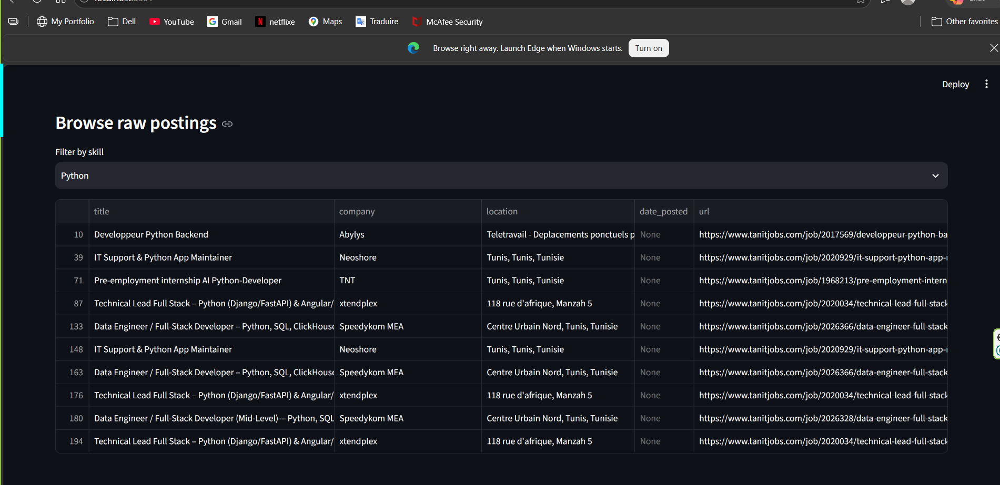
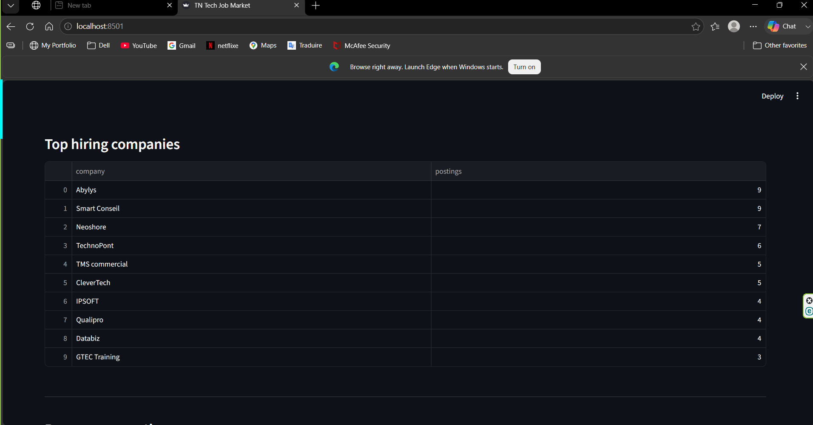
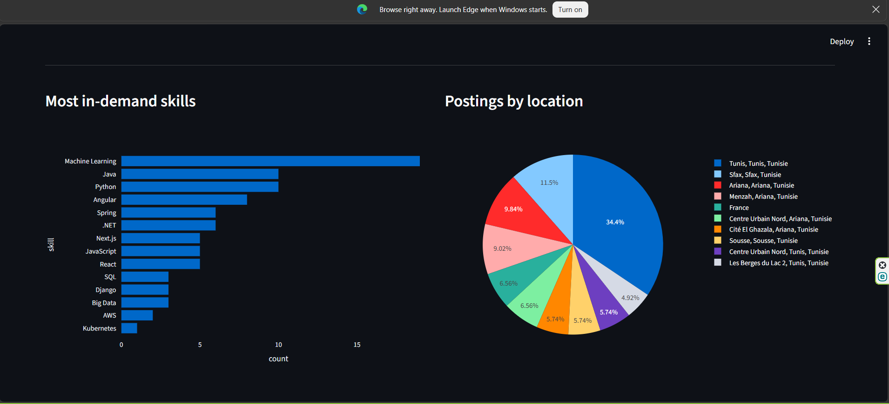

# Tunisia Tech Job Market Pipeline

An end-to-end data pipeline that scrapes IT job postings from Tunisian job boards,
extracts structured skill/location/company data, loads it into a database, and
visualizes it in an interactive dashboard.

## Demo
🔗 **[Live Demo](https://tn-job-market-pipeline0.streamlit.app/)** 







## Architecture

```
Scrape (requests + BeautifulSoup)
        │
        ▼
  data/raw/*.json          (raw, timestamped snapshots)
        │
        ▼
Transform (pandas + regex skill extraction)
        │
        ▼
  data/processed/*.csv     (clean, deduplicated tables)
        │
        ▼
Load (SQLite)
        │
        ▼
  data/processed/jobs.db
        │
        ▼
Dashboard (Streamlit + Plotly)
```

## Project structure

```
tn-job-market-pipeline/
├── scraper/
│   └── scrape_tanitjobs.py     # extraction layer
├── transform/
│   └── transform_jobs.py       # cleaning + skill extraction
├── db/
│   └── load_db.py              # loads processed data into SQLite
├── dashboard/
│   └── app.py                  # Streamlit analytics dashboard
├── data/
│   ├── raw/                    # raw scraped JSON (gitignored, generated locally)
│   └── processed/              # clean CSVs + jobs.db (gitignored, generated locally)
├── requirements.txt
└── README.md
```

## Setup

```bash
python -m venv venv
source venv/bin/activate      # Windows: venv\Scripts\activate
pip install -r requirements.txt
```

## Running the pipeline

```bash
# 1. Scrape job postings (raw data)
python scraper/scrape_tanitjobs.py --pages 5

# 2. Transform: clean + extract skills
python transform/transform_jobs.py

# 3. Load into database
python db/load_db.py

# 4. Launch dashboard
streamlit run dashboard/app.py
```

## Important: before your first scrape

Job board HTML changes over time and the CSS selectors in `scraper/scrape_tanitjobs.py`
(`SELECTORS` dict) were written from a general read of the site's structure, not a live
browser inspection. **Before running:**

1. Open https://www.tanitjobs.com/categories/705/informatique-jobs/ in your browser
2. Right-click a job listing → "Inspect"
3. Note the actual class names / tags wrapping each job card, title, company, etc.
4. Update the `SELECTORS` dict in `scrape_tanitjobs.py` to match
5. Also check https://www.tanitjobs.com/robots.txt to confirm the pages you're scraping are allowed

Run with `--pages 1` first to confirm it's working before scraping more pages.

This selector-tuning step is normal for any real scraping project — it's worth
mentioning in interviews as evidence you understand scrapers need maintenance, not
just that you copy-pasted a tutorial.

## Extending this project

- **Add more sources**: duplicate `scrape_tanitjobs.py` for Tanqeeb or other boards,
  tag each posting with its `source` field (already in the schema)
- **Schedule it**: run the pipeline weekly via cron to build a real time-series of
  skill demand over months — this is what turns a snapshot into an actual trend analysis
- **Upgrade to PySpark**: once you have several weeks of data, rewrite the transform
  step in PySpark instead of pandas — same logic, but demonstrates distributed
  processing tooling, which is the more "Big Data" version of this project
- **Upgrade to PostgreSQL**: swap `sqlite3` for `psycopg2` in `db/load_db.py`,
  point it at a free-tier Postgres instance (Supabase, Neon, or Railway all have
  free tiers), deploy the dashboard on Streamlit Community Cloud for a live public link

## Ethical scraping notes

- Rate-limited (2s delay between requests)
- Identifies itself via a descriptive User-Agent
- Only collects publicly visible posting data
- Respects robots.txt — verify before running

## Author

Med Karim Hammami — built as a portfolio project to complement Big Data / full-stack
studies at ISIMS, and to track the Tunisian tech job market during an active job search.
